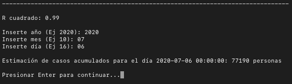

# Machine Learning Argentina

Repositorio creado por Sebastian San Blas.

Script para calcular diferentes modelos de machine learning sobre los casos de COVID-19 en Argentina.

## ¿Qué se puede realizar con este script?

   1)  Graficar casos confirmados de COVID-19 en Argentina, o en provincias.
   

  

   2)  Estimar la cantidad de contagios de COVID-19 que habrá en Argentina o en
    alguna provincia en un día determinado.
    

  

  

   3)  Regresión logística.
   

  

## ¿Cómo ejecutar?

Dar permisos de ejecución `chmod +x ml_argentina.py`

Ejecutar `./ml_argentina.py`

## Dependencias

Los modulos necesarios se encuentran en el archivo requirements.txt.

Para instalar los módulos, ejecute con permisos el archivo dependencies_covid.py con el comando:

`chmod +x project/dependencies_covid.py`

## Data

Los datos históricos provienen de la página oficial del Ministerio de Salud de la Nación.

### Descarga y uso de datos

Es posible [_Descargar el CSV de datos históricos oficiales_](https://sisa.msal.gov.ar/datos/descargas/covid-19/files/Covid19Determinaciones.csv).

Para poder entender las columnas del archivo .csv, [_ver "campos de este recurso"_](http://datos.salud.gob.ar/dataset/covid-19-casos-registrados-en-la-republica-argentina/archivo/fd657d02-a33a-498b-a91b-2ef1a68b8d16).

## Todo

- [x] Introducir fecha para estimar casos en formato YEAR-MM-DD (opción 2).
- [x] Agregar función para regresión logística (opción 3).
- [ ] Mejorar predicción (opción 2).
- [ ] Mejorar precisión de regresión logística.
- [ ] Corrección de docstrings en funciones.
- [ ] Completar documentación.
- [ ] Completar test de funciones.

## Importante

Este script es totalmente estadístico y carece de carácter médico.
Los valores ofrecen una estimación de cómo podrían evolucionar los acontecimientos de mantenerse la tendencia actual.

Por favor, seguir las recomendaciones básicas para evitar contagios:
   1) QUÉDATE en casa lo máximo posible.
   2) MANTÉN el distanciamiento social.
   3) LÁVATE las manos con frecuencia.
   4) TOSE o ESTORNUDA en el pliegue del codo.
   5) LLAMA a los servicios de emergencias si tienes síntomas.

Más información [aquí](https://www.who.int/es/emergencies/diseases/novel-coronavirus-2019/advice-for-public)

## Licencia

El trabajo se publica bajo licencia Atribución-NoComercial 4.0 Internacional (CC BY-NC 4.0).
Ver [Licencia CC BY-NC 4.0](https://creativecommons.org/licenses/by-nc/4.0/legalcode) para mayor detalles.

## Sugerencias

¡Son más que bienvenidas!

Para correcciones de errores, sugerencias o alguna función adicional, por favor, envíame un mensaje a sebastiansanblas@gmail.com o a [@sebasanblas1](https://twitter.com/SebaSanBlas1).

Gracias.
